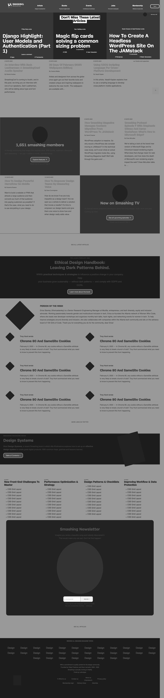

<!-- @format -->

# Design Teardown

> In this project we had to perform a design teardown of the Smashing Magazine website, where we had to paint a picture in grayscale of visual hierarchy, in other word sections of the page that stood out "caught your eye" more that the others. This project focus on visual hierarchy, typography and design principles.

Additional description about the project and its features.

## Built With

- HTML CSS,
- Flexbox, Css Grid

## Live Demo

[Live Demo Link](https://rawcdn.githack.com/aulbytj/DesignTeardown/943456754b41c7856def2954e0e870517bac2d5b/index.html)

## Authors

👤 **Aulbourn Knowles**

- Github: [@aulbytj](https://github.com/aulbytj)
- Twitter: [@aulbytj](https://twitter.com/aulbytj)
- Linkedin: [Aubourn Knowles](https://linkedin.com/in/aulbourn-knowles-b9971672)

👤 **Author2**

- Github: [@kagaramag](https://github.com/kagaramag)
- Twitter: [@kagaramag](https://twitter.com/kagaramag)
- Linkedin: [kagarama](https://linkedin.com/in/kagarama)

## 🤝 Contributing

Contributions, issues and feature requests are welcome!

Feel free to check the [issues page](https://github.com/aulbytj/DesignTeardown/issues).

## Show your support

Give a ⭐️ if you like this project!

## Acknowledgments

- GitKraken, Microverse TSE's
- Smashing Magazine, Microverse
